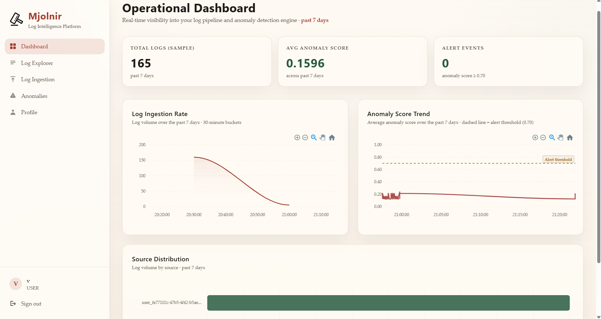
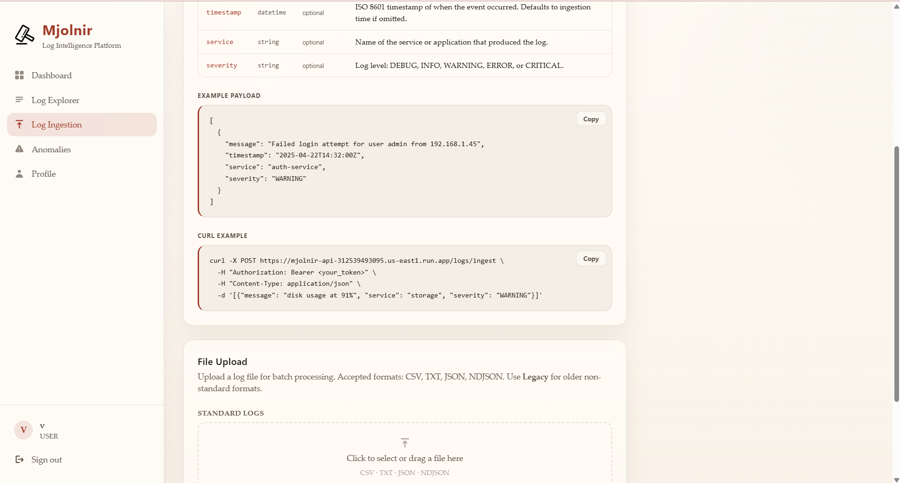
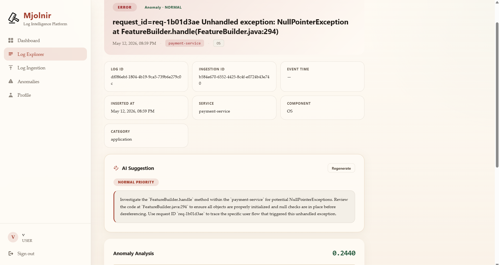
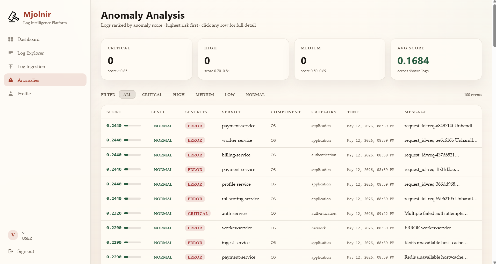

# Mjolnir

Mjolnir is an AI-assisted log monitoring platform that ingests application logs, enriches them with structured metadata, scores anomalous behavior, and presents operational insights through a secure web dashboard.

  

## Screenshots

| Dashboard | Log Ingestion |
| --- | --- |
|  |  |

| Log Explorer | Anomaly Analysis |
| --- | --- |
|  |  |

## Project Highlights

- Built a full-stack observability platform with a Next.js dashboard and FastAPI backend for ingesting, browsing, and analyzing structured and legacy log data.
- Designed a secure ingestion workflow with JWT authentication, API key generation, file uploads, and protected user-specific log access.
- Implemented log enrichment and anomaly detection pipelines using Python, scikit-learn models, rule-based severity inference, and AI-generated remediation suggestions.
- Integrated Google Cloud services including Cloud Run, Pub/Sub, Cloud Storage, and BigQuery to support scalable log processing, storage, and analytics.

## Stack

**Frontend:** Next.js 14, React 18, TypeScript, Tailwind CSS, ApexCharts, TanStack React Table, Axios  
**Backend:** Python, FastAPI, Pydantic, SQLAlchemy, Uvicorn  
**AI / ML:** scikit-learn, pandas, NumPy, SciPy, joblib, Google GenAI  
**Cloud / Data:** Google Cloud Pub/Sub, Cloud Storage, BigQuery, Cloud Run, Terraform  
**Security:** JWT access tokens, refresh-token cookies, bcrypt password hashing, API key support  

## Features

- Real-time dashboard with log volume, anomaly score trends, source distribution, and alert counts.
- REST and file-based log ingestion for JSON, CSV, TXT, NDJSON, and legacy log formats.
- Log explorer with paginated records, severity badges, anomaly scores, and detailed event views.
- Anomaly page that ranks events by risk level and filters logs by score severity.
- Profile page for account details and long-lived API key generation.

